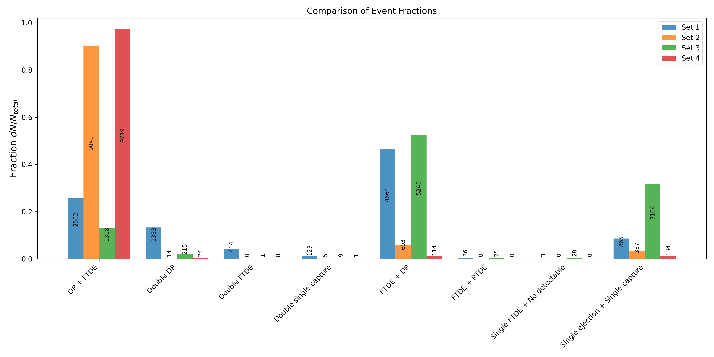

This repository is to store plots that I have made for data analisis in my investigation or other projects.

All the plots are designed, in principel, for dataframes but they can be adapted to other files. These are demo plots and use dummy dataframes in order to work. 

## Requirements

To run the scripts, you will need:
* Python 3.x
* pandas
* matplotlib.pyplot
* matplotlib.gridspec
* seaborn
* scipy

The dataframes are generated independently in each script using a function called `dummy_df(N,seed)`, with *N* the number of points to generate and *seed* the seed to randomly generate them. Every time you run the file it will give different results. If you don't want that, you can create a single dataframe using the function, just add the line `df.to_csv("path/to/the/dataframe.csv")`, for example, after `df = pd.DataFrame(datos)` and use the generated dataframe in the other scripts.

The columns of the dummy dataframes are listed below, along with a brief description:

| Variable name | Description |
|---------------|-------------|
| `event_ID`    | String to classify data, thinked to be a final state of a system |
| `Detectable`  | Characteristic of `event_ID` used to agrupate them |
| `M1`          | Intended to represent an angle in degrees |
| `rp2`         | Float number, can take any positive real value |

You are free to change the columns of the dataframe in any way you like, the table is just a guide to understand his content, and have a sence of why each plot is designed the way it is.

Now I will explain how each script works and what are the outputs.

## `histogram_simulations.py`

Generates a histogram with the `event_ID` fraction of one, or multiple dataframes. The histogram is generated with `multi_histo(*histos, labels=None)`, where in the argument `*histos` we can put multiple '.csv', in this way we can compare the fraction of `event_ID` if multiple dataframes. An example of the generated histogram is showed below

## `phase_space_hist.py`

Make a phase space plot with the distribution of every `event_ID` based in `rp2` and `M1`. In the top and right part of the plot there are histogram to show the distribution of every event in each axis, the histograms are color codded based on the legend of the plot. An example phase space is showed below

## `hist_chi.py`

Plot the histogram in the x axis of `phase_space_hist.py`and applies a chi square test for a Gaussian distribution to every element in `event_ID`. The events are color coded following the phase space. An example histogram is showed below

